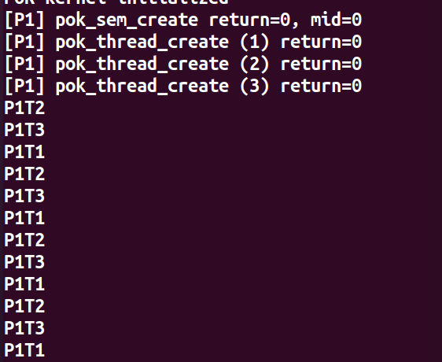
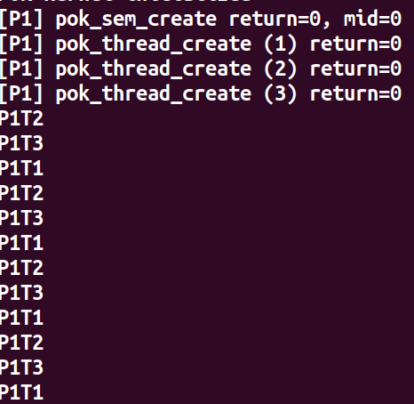
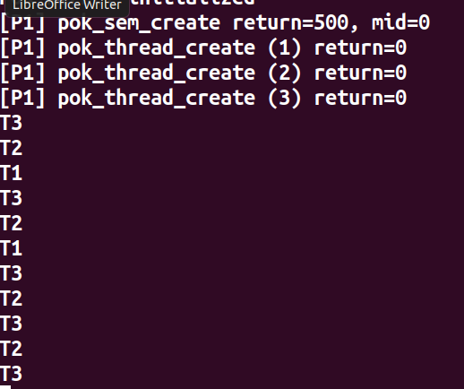
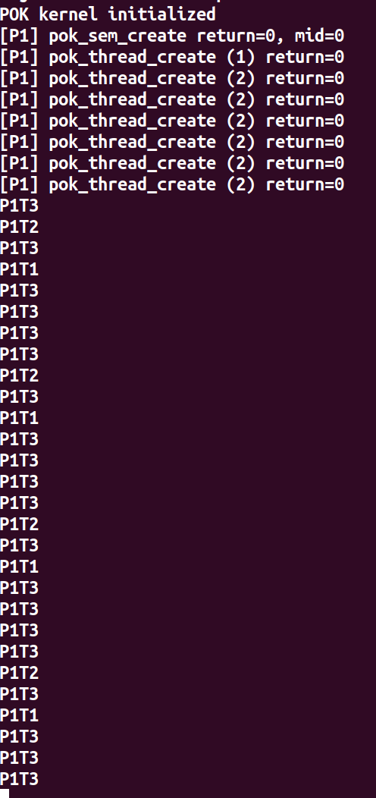

## 设计文档

原本的 pok 内核中支持 RMS 以及 Round Robin 调度算法，在作业中需要增加 EDF，FP 以及 Weighted Round Bobin 算法，主要修改文件是 kernel/core/sche.c 文件。

### EDF 调度算法：

```c
#ifdef POK_NEEDS_SCHED_EDF
uint32_t pok_sched_part_edf(const uint32_t index_low, const uint32_t index_high, const uint32_t prev_thread, const uint32_t current_thread) {
	uint32_t res;

	res = index_low;
	uint32_t current_earliest_deadline = POK_THREAD_MAX_DEADLINE; 
	uint32_t current_earliest_deadline_thread = res;

	do {
		if (pok_threads[res].deadline < current_earliest_deadline && pok_threads[res].state == POK_STATE_RUNNABLE) {
			current_earliest_deadline = pok_threads[res].deadline;
			current_earliest_deadline_thread = res;
		}
		res++;
	} while(res < index_high);

	res = current_earliest_deadline_thread;

	if ((res == index_low) && (pok_threads[res].state != POK_STATE_RUNNABLE)) {
		res = IDLE_THREAD;
	}

	return res;
}
#endif
```

自己定义了最大的 deadline 值，每次时钟周期调用该函数的时候都会遍历所有的线程找到能够运行而且 deadline 最近的去执行。

测试的时候将修改两个任务的 deadline， 第一个任务 deadline 改为 5000， 第二个任务 deadline 改为 3000，测试结果达到预期。 



### FP 调度算法

```c
#ifdef POK_NEEDS_SCHED_FP
uint32_t pok_sched_part_fp(const uint32_t index_low, const uint32_t index_high, const uint32_t prev_thread, const uint32_t current_thread) {
	uint32_t res;

	res = index_low;
	uint32_t highest_priority_thread = res;
	uint32_t current_highest_priority = POK_THREAD_MAX_PRIORITY;

	do {
		if (pok_threads[res].priority < current_highest_priority && pok_threads[res].state == POK_STATE_RUNNABLE) {
			highest_priority_thread = res;
			current_highest_priority = pok_threads[res].priority;
		}
		res++;
	} while (res < index_high);

	res = highest_priority_thread;

	if ((res == index_low) && (pok_threads[res].state != POK_STATE_RUNNABLE)) {
		res = IDLE_THREAD;
	}

	return res;
}
#endif
```

POK 有自己定义的最大的优先级，在每次时钟周期调用这个函数的时候会比较所有线程找到优先级最高的线程去执行。

测试的时候修改两个任务的优先级，第一个改为42， 第二个改为22， 测试结果达到预期。



### WRR 调度算法

```c
#ifdef POK_NEEDS_SCHED_WRR
uint32_t pok_sched_part_wrr(const uint32_t index_low, const uint32_t index_high, const uint32_t prev_thread, const uint32_t current_thread) {
   uint32_t res;
   uint32_t from;

   if (current_thread == IDLE_THREAD)
      res = prev_thread;
   else
      res = current_thread;

   from = res;

   uint32_t i = 0;
   int weight_gcd = 0;
   for (i = index_low; i < index_high; i++){
      if (pok_threads[i].state == POK_STATE_RUNNABLE){
         if (weight_gcd != 0){
            weight_gcd = gcd(weight_gcd, pok_threads[i].weight);
         }
         else{
            weight_gcd = pok_threads[i].weight;
         }
      }
   }

   int weight_max = (1 << 31);
   for (i = index_low; i < index_high; i++){
      if (pok_threads[i].state == POK_STATE_RUNNABLE &&
          pok_threads[i].weight > weight_max){
         weight_max = pok_threads[i].weight;
      }
   }
   if (weight_max <= 0)
      return IDLE_THREAD;

   i = index_low - 1;
   int current_weight = 0;

   if (pok_partitions[pok_current_partition].current_weight != 0){
      current_weight = pok_partitions[pok_current_partition].current_weight;
   }

   for (i = index_low; i <= index_high; i++){
      if (pok_threads[i].weight > 0 && pok_threads[i].weight == weight_max){
         pok_threads[i].weight--;
         return i;
      }
   }
   
   i = index_low;
   do {
     if (i == index_low){
         pok_partitions[pok_current_partition].current_weight = current_weight= current_weight - weight_gcd;
         if (current_weight <= 0){
            pok_partitions[pok_current_partition].current_weight = current_weight = weight_max;
            if (current_weight == 0){
               res = IDLE_THREAD;
               break;
            }
         }
      }
      if (pok_threads[i].weight >= current_weight){
         res = i;
         break;
      }
      i++;
   } while(i <= index_high);

   if ((res == from) && (pok_threads[res].state != POK_STATE_RUNNABLE)){
      res = IDLE_THREAD;
   }
   return res;

}
#endif
```

参考 nginx 使用的 WRR 调度算法。给 thread 数据结构定义了 weight 属性，同时给 partition 定义了current_weight 属性记录当前的权重初始值为 0。

1. 计算所有权重的最大公约数。
2. 将current_weight设为最大的权重。
2. 将权重大于或等于current_weight 的线程返回, 记住该位置。
3. (没有符合的权重后)将 current_weight 的值减去 gcd (最大公约数)。



### 算法比较

* EDF更具截止时间动态分配，截止时间越短，优先级越高。这种调度策略是最优的。但是对于非抢占式任务来说它不是最优的。

* FP 实现比较容易，但是会有大量饿死的问题。

* WRR 相对于Round Robin 它能够给更加强大的机器更多的任务负载，负载高的机器降低负载，但是它的实现相对复杂。

### 动态调用

没法使用 pok 自己的 getChar 方法，每次调用的时候都会报错。我在创建线程的时候使用 pok 的 rand（） 方法来随机生成线程，模拟动态调用的情况。

通过随机生成线程的优先级加入到线程队列中。

**pok 的 rand() 方法好像不是随机，通过大数据的去余来作为结果，每次的输出都是一样的。**



## MLFQ

### 算法简述

有三个队列，假设前两个按照 round robin 的调度策略，时间片分别是4 和 8，第三个队列遵循 FCFS 调度策略。

1. 当一个进程开始执行，先进入队列1.
2. 在队列1 中执行4个单位时间，当它在4个单位时间内完成或者在执行IO操作,那么他的优先级不会降低，如果再次进入队列，那么还是从队列1开始。
3. 如果在4个单位时间内未完成，他的优先级下降，转换到队列2.
4. 在队列2中策略和上述两点相同，但是时间片为8个单位时间。如果进程没有在这个时间内完成就到第三个队列中。
5. 在最后一个队列执行FCFS策略。
6. 在低级别的队列只能等高级别的队列没有任务执行时才能开始执行。
7. 在低级别的队列的任务会被高级别的队列新进入的任务抢占。

### 算法实现

使用 Python 实现

```python
class MLFQ():
    def __init__(self):
        self.queue1 = RRQueue(quantum=4)
        self.queue2 = RRQueue(quantum=8)
        self.queue3 = FCFSQueue()

    def addTask(self, Task):
        self.queue1.enqueue(Task)

    def execuate(self):
        if(self.queue1.empty()):
            if (self.queue2.empty()):
                if (self.queue3.empty()):
                    return
                else:
                    self.queue3.execuate()
            else:
                task = self.queue2.execuate()
                if task:
                    self.queue3.enqueue(task)
        else:
            task = self.queue1.execuate()
            if task:
                self.queue2.enqueue(task)
```

主函数部分

```python
class RRQueue():
    def __init__(self, quantum):
        self.items: Task = []
        self.quantum = quantum
        self.current_execuate_time = 0

    def enqueue(self, item: Task):
        self.items.append(item)

    def empty(self):
        return not len(self.items)

    def execuate(self):
        if self.empty():
            return
        current_item = self.items[0]
        current_item.execuate_time = current_item.execuate_time - 1
        if current_item.execuate_time == 0:
            self.current_execuate_time = 0
            print('Task {}, finished'.format(self.items[0].name))
            self.items.pop(0)
            return None

        self.current_execuate_time = self.current_execuate_time + 1
        if self.current_execuate_time == self.quantum:
            item = self.items[0]
            self.items.pop(0)
            self.current_execuate_time = 0
            return item

        return None
```

第一个第二个队列的 round robin 简单实现

```python
class FCFSQueue():
    def __init__(self):
        self.items: Task = []

    def enqueue(self, item: Task):
        self.items.append(item)

    def empty(self):
        return not len(self.items)

    def execuate(self):
        if self.empty():
            return
        current_item = self.items[0]
        current_item.execuate_time = current_item.execuate_time - 1
        if current_item.execuate_time == 0:
            print('Task {}, finished'.format(self.items[0].name))
            self.items.pop(0)
```

FCFS 简单实现
